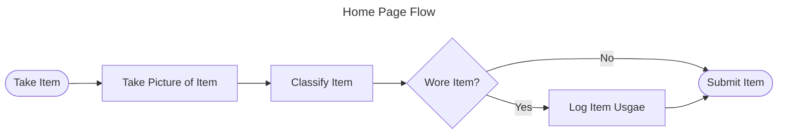
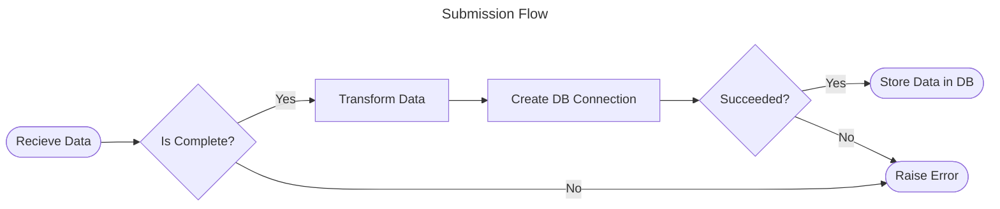

# Wardrobe_Manager

This project aims to create a webapp to keep track of your clothing usage.

## Topics

1. [Overview](#overview)
2. [Goals](#goals)
3. [Scope and Context](#scope-and-context)
4. [System Design](#system-design)
5. [Alternatives Considered](#alternatives-considered)
6. [Learning Logs](#learning-logs)
7. [Resources](#resources)

---

## Overview

## Goals

## Scope and Context

## System Design

## Alternatives Considered

## Learning Logs

| Date | Learning |
|------|----------|
|      |          |

## Resources
